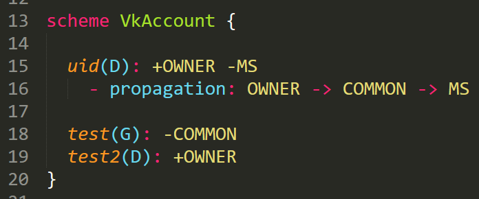

####
KSDL
####

(в процессе написания)

**Kero-Security Declarative Language** - небольшой декларативный язык, используемый для описания схем доступа Kero-Security.

---------
Синтаксис
---------

Ключевые слова:

* ``scheme`` - начало объявления схемы
* ``-`` - начало металайна
* ``:`` - начало шорт блока
* ``\n`` (перенос строки) - конец шорт блока
* ``{`` - начало обычного блока
* ``}`` - конец обычного блока

.. note::
	Блоки взаимозаменяемы т.е.

	.. code-block::

		- propagation: OWNER -> FRIEND -> COMMON
	
	идентично

	.. code-block::

		- propagation {

		  OWNER ->
		  FRIEND ->
		  COMMON
		}

Схема
^^^^^

Объявление схемы:

.. code-block::

	scheme SomeScheme(G) {
	  ...
	}

* ``scheme`` - ключевое слово
* SomeScheme - название схемы
* ``(G)`` - дефолтное правило доступа (опционально)
* ``{`` - начало тела схемы (опционально)

Свойство
^^^^^^^^

Объявление свойства:

.. code-block::

	scheme SomeScheme {

	  obj(D): +OWNER -FRIEND 
	}

* obj - имя свойства
* ``(D)`` - дефолтное правило доступа (опционально)
* ``:`` - начало тела свойства (опционально)

В теле свойства указываются роли, которые имеют доступ (перед их названием ставится ``+``) и роли которым он запрещен (перед их названием ставится ``-``).

Дефолтное правило доступа
^^^^^^^^^^^^^^^^^^^^^^^^^

Для установки дефолтного правила, вам необходимо после имени свойства или схемы написать флаг:

* ``(G)`` \- по дефолту разрешать доступ
* ``(D)`` \- по дефолту запрещать доступ

.. code-block::

	scheme SomeScheme(G): {

	  obj(D)
	}	

Металайны
^^^^^^^^^

**Propagation** - настройка распространения доступа.

.. code-block::

	- propagation: OWNER -> FRIEND -> COMMON

.. note::
	Если нужно настроить несколько цепочек распространения, напишите отдельный металайн для новой цепочки.

------------------------
Соглашение по стилю кода
------------------------

* Отступ вложенности - 2 пробела или 1 таб.
* Скобка открытия блока не переносится на новую строку.
* После открытия блока делается отступ в 1 строку.
* После закрытия блока делается отступ в 1 строку.
* После последнего металайна делается отступ в 1 строку (если далее идет следующее свойство).